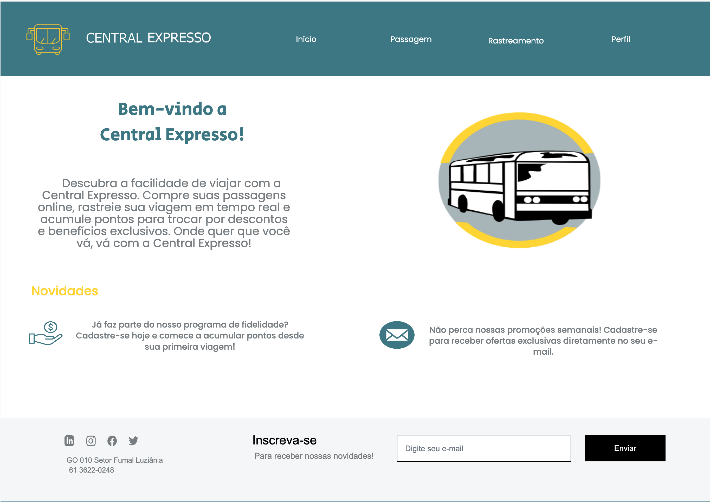

## Introdução

Para realização da avaliação foi necessária a confecção de protótipos de alta fidelidade para cada funcionalidade que aqui estão dispostos.

## Metodologia

A elaboração de cada prótotipo seguiu algumas orientações acordadas entre os membros da equipe assim como citado no tópico "Referência para elaboração do protótipo de alta fidelidade" no artefato de planejamento da avaliação.

## Elementos comuns

Na figura 1, está a tela inicial que deve ser utilizada em todos os demais protótipos de alta fidelidade.

 Figura 1 - Protótipo de Alta Fidelidade 

Fonte: <a href=""> Alana Gabriele </a>

## Protótipo de Alta Fidelidade

Funcionalidade: Rastreamento de Ônibus em Tempo Real (Alana Gabriele)

    Nas figuras 1 e 2 estão os prótotipos elaborados para a funcionalidade.
    
 Figura 1 - Protótipo de Alta Fidelidade de Rastreamento de Ônibus em Tempo Real 
    
    
Fonte: <a href=""> Alana Gabriele </a>

    
 Figura 2 - Protótipo de Alta Fidelidade de Rastreamento de Ônibus em Tempo Real 
    
    
Fonte: <a href=""> Alana Gabriele </a>

    
Funcionalidade: Compartilhamento de Trajetos (Gustavo Alves) 

    Nas figuras 4, 5, 6 e 7 estão os prótotipos elaborados para a funcionalidade.
    
 Figura 4 - Protótipo de Alta Fidelidade Compartilhamento de Trajetos 
    
    
Fonte: <a href=""> Gustavo Alves </a>

    
 Figura 5 - Protótipo de Alta Fidelidade Compartilhamento de Trajetos 
    
    
Fonte: <a href=""> Gustavo Alves </a>

    
 Figura 6 - Protótipo de Alta Fidelidade Compartilhamento de Trajetos 
    
    
Fonte: <a href=""> Gustavo Alves </a>

    
 Figura 7 - Protótipo de Alta Fidelidade Compartilhamento de Trajetos 
    
    
Fonte: <a href=""> Gustavo Alves </a>

    
 Funcionalidade: Histórico de passagens compradas (Marco Tulio) 

    Nas figuras 9, 10, 11, e 12 estão os prótotipos elaborados para a funcionalidade.
    
 Figura 9 - Protótipo de Alta Fidelidade Histórico de passagens compradas
    
    
Fonte: <a href=""> Marco Tulio </a>

    
 Figura 10 - Protótipo de alta fidelidade Histórico de passagens compradas
    
    
Fonte: <a href=""> Marco Tulio </a>

    
 Figura 11 - Protótipo  de alta fidelidade de passagens compradas
    
    
Fonte: <a href=""> Marco Tulio </a>

    
 Figura 12 - Protótipo de alta fidelidade Histórico de passagens compradas
    
    
Fonte: <a href=""> Marco Tulio </a>

    
 Figura 13 - Protótipo de alta fidelidade Histórico de passagens compradas
    

    
Funcionalidade: Acúmulo de Pontos por Trajeto (Pedro Henrique)

    Nas figuras 13, 14, 15, 16 e 17 estão os prótotipos elaborados para a funcionalidade.
    
 Figura 13 - Protótipo de Alta Fidelidade Acúmulo de Pontos por Trajeto
    
    
Fonte: <a href=""> Pedro Henrique </a>

    
 Figura 14 - Protótipo de Alta Fidelidade Acúmulo de Pontos por Trajeto
    
    
Fonte: <a href=""> Pedro Henrique </a>

    
 Figura 14 - Protótipo de Alta Fidelidade Acúmulo de Pontos por Trajeto
    
    
Fonte: <a href=""> Pedro Henrique </a>

    
 Figura 15 - Protótipo de Alta Fidelidade Acúmulo de Pontos por Trajeto
    
    
Fonte: <a href=""> Pedro Henrique </a>

    
 Figura 16 - Protótipo de Alta Fidelidade Acúmulo de Pontos por Trajeto
    
    
Fonte: <a href=""> Pedro Henrique </a>

    
 Figura 17 - Protótipo de Alta Fidelidade Acúmulo de Pontos por Trajeto
    
    
Fonte: <a href=""> Pedro Henrique </a>

    
 Funcionalidade: Acompanhar compra de passagem (Renan Araújo)

    Nas figuras 18, 19, 20 e 21 estão os prótotipos elaborados para a funcionalidade.
    
 Figura 18 - Protótipo de Alta Fidelidade Acompanhar compra de passagem
   
    
Fonte: <a href=""> Renan Araújo </a>

    
 Figura 19 - Protótipo de Alta Fidelidade Acompanhar compra de passagem
     
    
Fonte: <a href=""> Renan Araújo </a>

    
 Figura 20 - Protótipo de Alta Fidelidade Acompanhar compra de passagem
     
    
Fonte: <a href=""> Renan Araújo </a>

    
 Figura 21 - Protótipo de Alta Fidelidade Acompanhar compra de passagem
  
    
Fonte: <a href=""> Renan Araújo </a>

    
 Funcionalidade: Comprar passagem (Yasmim Rosa)  

    Nas figuras 22, 23, 24, 25, 26, 27, 28 e 29 estão os prótotipos elaborados para a funcionalidade.
    
 Figura 22 - Protótipo de Alta Fidelidade Comprar passagem
    
    
Fonte: <a href=""> Yasmim Rosa </a>

    
 Figura 23 - Protótipo de Alta Fidelidade Comprar passagem
    
    
Fonte: <a href=""> Yasmim Rosa </a>

    
 Figura 24 - Protótipo de Alta Fidelidade Comprar passagem
    
    
Fonte: <a href=""> Yasmim Rosa </a>

    
 Figura 25 - Protótipo de Alta Fidelidade Comprar passagem
    
    
Fonte: <a href=""> Yasmim Rosa </a>

    
 Figura 26 - Protótipo de Alta Fidelidade Comprar passagem
    
    
Fonte: <a href=""> Yasmim Rosa </a>

    
 Figura 27 - Protótipo de Alta Fidelidade Comprar passagem
    
    
Fonte: <a href=""> Yasmim Rosa </a>

## Bibliografia

> BARBOSA, S. D. J.; SILVA, B. S. Interação Humano-Computador. Rio de Janeiro: Elsevier, 2011.

## Histórico de Versões

| Versão |    Data    | Descrição                        | Autor(es)                               | Revisor(es)       |
| ------ | :--------: | -------------------------------- | --------------------------------------- | ----------------- |
| 1.0    | 19/06/2024 | Protótipos de Papel              | [Yasmim Rosa]()   [Alana Gabriele]() | [Marco Tulio]()   |
| 1.1    | 03/06/2024 | Protótipos de Papel Rastreamento | [Yasmim Rosa]()   [Alana Gabriele]() | [Gustavo Alves]() |
