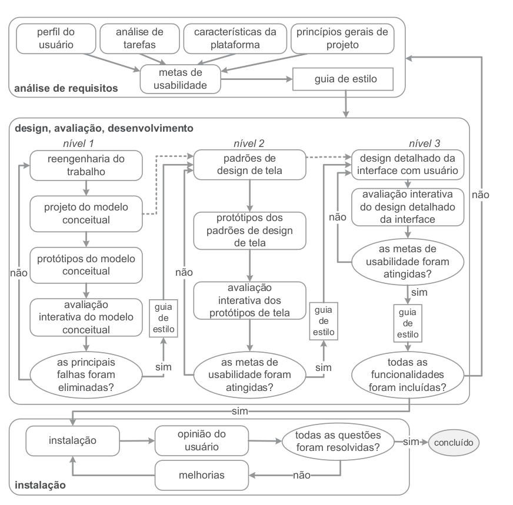

## Introdução
De acordo com Barbosa e Silva (2011), o processo de design de um projeto diz respeito a execução de atividades de forma iterativa de forma a identificar a situação atual e elaborar uma proposta de intervenção, comumente nesta ordem.

O ciclo de vida de Mayhew (Figura 1) foi o processo de design elegido para esse projeto devido ao seu nível de detalhamento das fases e, portanto, mais adequado para iniciantes. 

 Figura 1 - Engenharia de Usabilidade de Mayhew  

 Fonte: BARBOSA, S. D. J.; SILVA, B. S. Interação Humano-Computador. Rio de Janeiro: Elsevier, 2011.

## Execução
Na tabela 1 estão dispostas cada fase do ciclo de vida de Mayhew com suas devidas definições e artefatos gerados.

 Tabela 1 - Execução do Ciclo de Vida de Mayhew  

| Fase | Definição | Artefatos | 
|-------|-----------|---------------------------|
| Análise de Requisitos | É na fase de análise de requisitos em que são definidos as metas de usabilidade com base no perfil dos usuários, na análise das tarefas, nas capacidades e limitações da plataforma onde o sistema será usado, e nos princípios gerais de design de Interação Humano-Computador (IHC). As metas são muitas vezes descritos em "guias de estilo", que ajudam a verificar sua aplicação nas próximas etapas do projeto. | [Aspectos Éticos](../requisitos/etica.md)     [Perfil de Usuários](../requisitos/perfil_usuarios.md)     [Personas](../requisitos/perfil_usuarios.md)     [Análise de Tarefas (HTA)](../requisitos/analise_tarefas_hta.md)     [Análise de Tarefas (GOMS)](../requisitos/analise_tarefas_goms.md)     [Características da Plataforma](../requisitos/caracteristicas_gerais.md)    [Princípios Gerais do Projeto](../requisitos/principios_gerais.md)     [Metas de Usabilidade](../requisitos/metas_usabilidade.md)     [Guia de Estilo](../requisitos/guia_estilo.md)|
| Design, Avaliação e Desenvolvimento (Nível 1)| Nesta fase o objetivo é projetar uma solução que atenda as metas de usabilidade definidas na fase anterior, no nível 1 de detalhamento é realizado a engenharia de reetrabalho onde se repensa a execução das tarefas para alcançar os objetivos do usuário. | [Planejamento da Avaliação da Análise de Tarefas (HTA)](../design_avaliacao/nivel_1/analise_tarefas/planejamento_avaliacao.md)     [Planejamento do Relato da Avaliação da Análise de Tarefas (HTA)](../design_avaliacao/nivel_1/analise_tarefas/planejamento_relato_avaliacao.md)     [Relato da Avaliação da Análise de Tarefas (HTA)](../design_avaliacao/nivel_1/analise_tarefas/relato_avaliacao.md)     [Planejamento da Avaliação do Storyboard](../design_avaliacao/nivel_1/storyboard/planejamento_avaliacao.md)     [Planejamento do Relato da Avaliação do Storyboard](../design_avaliacao/nivel_1/storyboard/planejamento_resultados.md)     [Relato Avaliação do Storyboard](../design_avaliacao/nivel_1/storyboard/relato_resultados.md)|
| Design, Avaliação e Desenvolvimento (Nível 2)| Nesta fase o objetivo é projetar uma solução que atenda as metas de usabilidade definidas na fase anterior, nesse nível deve ser estabelecido os padrões de design de IHC para a solução em desenvolvimento. | [Planejamento da Avaliação do Prtótipo de Papel](../design_avaliacao/nivel_2/prototipo_papel/planejamento_avaliacao.md)     [Planejamento do Relato da Avaliação do Protótipo de Papel](../design_avaliacao/nivel_2/prototipo_papel//planejamento_relato.md)     [Relato da Avaliação do Protótipo de Papel](../design_avaliacao/nivel_2/prototipo_papel/relato.md) |
| Design, Avaliação e Desenvolvimento (Nível 3)| Nesta fase o objetivo é projetar uma solução que atenda as metas de usabilidade definidas na fase anterior, nesse nível é feito o protótipo detalhado (alta fidelidade) da interface para ser implementado. | [Planejamento da Avaliação do Prtótipo de Alta Fidelidade](../Design_avaliacao/nivel_3/planejamento_avaliacao_PAF.md)     [Planejamento do Relato da Avaliação do Protótipo de Alta Fidelidade](../Design_avaliacao/nivel_3/planejamento_relato_PAF.md)     [Relato da Avaliação do Protótipo de Alta Fidelidade](../Design_avaliacao/nivel_3/relato.md)  |

 Fonte: [Yasmim Rosa](https://github.com/yaskisoba)

## Bibliografia
> BARBOSA, S. D. J.; SILVA, B. S. Interação Humano-Computador. Rio de Janeiro: Elsevier, 2011.

## Histórico de Versões

| Versão |    Data    | Descrição                                 | Autor(es)                                       | Revisor(es)                                    |
| ------ | :--------: | ----------------------------------------- | ----------------------------------------------- | ---------------------------------------------- |
| 1.0    | 06/07/2024 | Criação |  [Yasmim Rosa](https://github.com/yaskisoba)   | [Renan Araújo](https://github.com/renantfm4)   |
