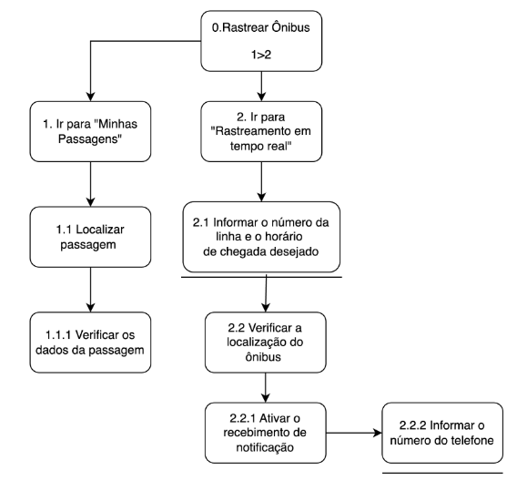

## Introdução
A análise de tarefas é utilizada para entender uma tarefa realizada pelo usuário, como ele a realiza e o por quê, uma técnica para realizar a análise de tarefas é chamada HTA (Hierarchical Task Analysis) que se baseia em psicologia funcional.  
No HTA o foco é primeiramente nos objetivos de alto nível que por sua vez são decompostos em subobjetivos e assim por diante.

## Metodologia
### Hierarchical Task Analysis

Como anteriormente citado, o HTA se inicia em um objetivo e vai se decompondo em subojetivos com relações entre si chamadas de plano. Um plano define os subobjetivos necessários para alcançar um outro objetivo maior, e a ordem em que esses subobjetivos devem ser alcançados (Barbosa e Silva, 2010).  
Quando um subjetivo se decompõe até seu nível mais básico, ele se converte em uma operação que é a unidade fundamental em HTA. Na Figura 24, estão os elementos e relações do HTA:

 Figura 23 - Elementos e relações HTA 

 Fonte: BARBOSA, S. D. J.; SILVA, B. S. Interação Humano-Computador. Rio de Janeiro: Elsevier, 2011.   

## Análise de Tarefas com HTA

### Rastreamento de Ônibus em Tempo Real
Nessa tarefa o usuário tem o objetivo de rastrear um ônibus.

 Figura 24 - HTA Rastreamento de ônibus em tempo real 

  

 Fonte: [Alana Gabriele](https://github.com/alanagabriele)

 Tabela 22 - HTA Rastreamento de ônibus em tempo real 

| **Objetivos / Operações** | **Problemas e Recomendações** |
|---------------------------|-------------------------------|
| **0. Rastrear Ônibus** |  |
| **1. Ir para 'Minhas Passagens'** | **input**: Clique na seção 'Minhas Passagens'.   **feedback**: A seção de passagens é carregada com todas as passagens compradas listadas.   **plano**: Garantir que a seção carregue rapidamente e mostre todas as informações relevantes.    |
| **1.1 Localizar passagem** | **input**: Seleção da passagem desejada.    **plano**: Assegurar que os detalhes úteis da passagem sejam facilmente legíveis.    |
| **1.1.1 Verificar os dados da passagem** |  **feedback**: Todas as informações necessárias são apresentadas.  |
| **2. Ir para 'Rastreamento em tempo real'** | **input**: Selecionar a opção no menu.   **feedback**: Tela de rastreamento é exibida com opções para localizar os ônibus.  |
| **2.1 Informar o número da linha e o horário de chegada desejado** | **input**: Entrada do número da linha e horário.   **feedback**: Sistema busca e mostra o status atualizado do ônibus.   **plano**: Reduzir erros de entrada de dados.   **recomendação**: Implementar validação de dados no campo de entrada. |
| **2.2 Verificar a localização do ônibus** | **input**: Visualização no mapa.   **feedback**: Mapa mostra a localização atual do ônibus.   **plano**: Melhorar a precisão do sistema de rastreamento.    |
| **2.2.1 Ativar o recebimento de notificação** | **input**: Opção de ativar notificações selecionada.   **feedback**: Usuário recebe confirmação de que as notificações estão ativas.   **plano**: Garantir entrega de notificações em tempo real.   **recomendação**: Testar e assegurar a confiabilidade do sistema de notificações. |
| **2.2.2 Informar o número de telefone** | **input**: Entrada do número de telefone no formulário.   **feedback**: Número é registrado para notificações via SMS.   **plano**: Proteger a privacidade dos dados do usuário.    |

 Fonte: [Alana Gabriele](https://github.com/alanagabriele)

### Compartilhamento de Trajetos. 
### Histórico de passagens compradas. 
### Acúmulo de Pontos por Trajeto. 
### Acompanhar compra de passagem. 
### Comprar passagem. 

## Bibliografia
> BARBOSA, S. D. J.; SILVA, B. S. Interação Humano-Computador. Rio de Janeiro: Elsevier, 2011.  

## Histórico de Versões

| Versão |    Data    | Descrição                                 | Autor(es)                                       | Revisor(es)                                    |
| ------ | :--------: | ----------------------------------------- | ----------------------------------------------- | ---------------------------------------------- |
| 1.0    | 05/05/2024 | HTA | [Yasmim Rosa](https://github.com/yaskisoba)    |     |
