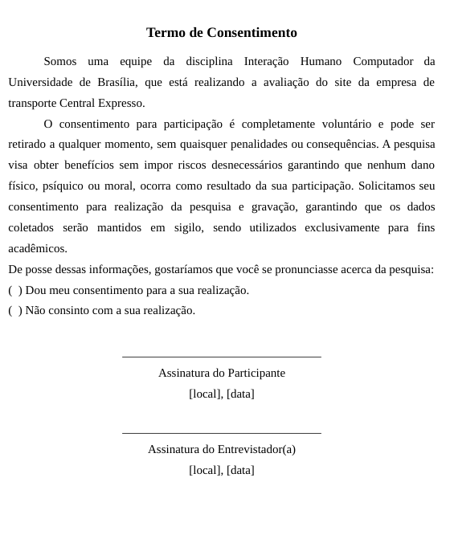

## Introdução
Os códigos de éticas são essenciais para regulamentar o exercícios de diversas profissões, o que ocorre também na área de computação onde há esse cuidado em pesquisas e intervenções orientadas por associações como a ACM (Association for Computing Machinery) e a IEEE (Instituto de Engenheiros Eletricistas e Eletrônicos), podemos destacar alguns cuidados éticos indicados:
<ul>
<li>Evitar danos ou consequências negativas aos outros; respeitar privacidade dos outros; e honrar a confidencialidade de informações a que tivermos acesso.</li>
<li>Evitar prejudicar ou causar dano a outras pessoas, seus bens, reputação ou emprego.</li>
</ul>

No Brasil, a pesquisa científicas com pessoas é regulamentada pela Resolução No 466/2012 do Conselho Nacional de Saúde onde podem ser destacados os seguintes princípios (p.2) definidos por Barbosa e Silva (2010):
<ul>
        <li>
            <strong>Princípio da Autonomia:</strong>
            
Envolve o consentimento livre e esclarecido dos indivíduos e a proteção a grupos vulneráveis e aos legalmente incapazes, tais como: menores de idade, alunos ou subordinados. Nesse sentido, a pesquisa envolvendo seres humanos deverá sempre tratá-los com dignidade, respeitá-los em sua autonomia e defendê-los em sua vulnerabilidade.

        </li>
        <li>
            <strong>Princípio da Beneficência:</strong>
            
Envolve a ponderação entre riscos e benefícios, tanto atuais como potenciais, individuais ou coletivos, comprometendo-se com o máximo de benefícios e o mínimo de danos e riscos. Os danos podem ocorrer na dimensão física, psíquica, moral, intelectual, social, cultural ou espiritual do ser humano, em qualquer fase da pesquisa ou depois dela.

        </li>
        <li>
            <strong>Princípio da Não Maleficência:</strong>
            
Envolve a garantia de evitar danos previsíveis relacionados à pesquisa, tanto os imediatos quanto os tardios.

        </li>
        <li>
            <strong>Princípio da Justiça e Equidade:</strong>
            
Relacionado à relevância social da pesquisa, com vantagens significativas para os participantes da pesquisa e minimização do ônus para os participantes vulneráveis, o que garante a igual consideração dos interesses envolvidos, não perdendo o sentido de sua destinação sócio-humanitária.

        </li>
    </ul>

Com base nesses princípios e na Resolução 510/2016 que regulamenta a pesquisa em Ciências Humanas e Sociais, as diretrizes sugeridas por Barbosa e Silva (2010) são:
<ul>
        <li>
            O pesquisador deve explicar os objetivos da pesquisa aos participantes e detalhar claramente a sua participação esperada.
        </li>
        <li>
            Durante a coleta de dados, deve ser informado aos participantes sobre o que ocorrerá, o tempo aproximado, os tipos de dados coletados e como serão analisados.
        </li>
        <li>
            Qualquer dúvida dos participantes deve ser esclarecida prontamente pelo avaliador.
        </li>
        <li>
            Os participantes devem ter garantida a confidencialidade e privacidade dos dados brutos coletados, compartilhados apenas com os pesquisadores após consentimento.
        </li>
        <li>
            Ao divulgar os resultados, garantir o anonimato dos participantes e preservar suas imagens e informações.
        </li>
        <li>
            Utilizar nomes fictícios ou códigos para identificar os participantes nos resultados da pesquisa.
        </li>
        <li>
            Obter permissão antes de gravar voz ou imagem de qualquer pessoa, informando os participantes sobre os tipos de gravações a serem realizadas.
        </li>
        <li>
            A participação deve ocorrer apenas com o consentimento livre e esclarecido dos participantes, com comunicação clara dos objetivos, procedimentos, riscos e direitos.
        </li>
        <li>
            Garantir o conforto dos participantes física e psicologicamente, oferecendo instalações adequadas e tratando-os com respeito.
        </li>
        <li>
            O participante tem o direito de recusar ou retirar seu consentimento em qualquer fase da pesquisa, sem penalizações.
        </li>
        <li>
            Interromper a pesquisa se o participante estiver passando por desconforto físico, emocional ou psíquico.
        </li>
    </ul>

## Termo de Consentimento Livre e Esclarecido (TCLE)
O termo de consentimento, como citado anteriormente, é de extrema importância para a realização de pesquisa com seres humanos para garantir seus direitos, concientizar a cerca deles e tranquilizar sobre a utilização os dados do participante. Foi então elaborado um termo que será utilizado com os participantes da pesquisa deste projeto.

 Figura 11 - Termo de Consentimento Livre e Esclarecido 

 

 Fonte: [Alana Gabriele](https://github.com/alanagabriele) e [Pedro Henrique](https://github.com/PedroHenrique061). Disponível em: [Google Docs](https://docs.google.com/document/d/1SYxAgTJFDZQ4u4j6DUbN0arY3rBEV0UuM4vYtjSpkd8/edit?usp=sharing).

## Bibliografia
> BARBOSA, S. D. J.; SILVA, B. S. Interação Humano-Computador. Rio de Janeiro: Elsevier, 2011.  

> Resolução nº 466, de 12 de dezembro de 2012. Brasília, DF: Diário Oficial da União, 2013. Disponível em: https://conselho.saude.gov.br/resolucoes/2012/Reso466.pdf. Acesso em: 08 de março de 2023.

## Histórico de Versões

| Versão |    Data    | Descrição                                 | Autor(es)                                       | Revisor(es)                                    |
| ------ | :--------: | ----------------------------------------- | ----------------------------------------------- | ---------------------------------------------- |
| 1.0    | 08/04/2024 | Aspectos éticos | [Alana Gabriele](https://github.com/alanagabriele)   [Pedro Henrique](https://github.com/PedroHenrique061) |   [Yasmim Rosa](https://github.com/yaskisoba)  |
