## Introdução

De acordo com Barbosa e Silva (2010), o perfil de usuário é o primeiro passo para registrar o entendimento sobre os usuários ao traçar um perfil sobre eles e nos ajuda a entender o público alvo do produto em questão.

## Metodologia
Foi realizada a coleta de dados por meio de um questionário, devido a sua capacidade de maior alcance de respostas e, também, pesquisa de documentação por meio estudos realizados sobre a migração pendular entre o município de Luziânia e Brasília.

## A migração pendular Luziânia-GO/Brasília-DF
Luziânia é parte da Periferia Metropolitana de Brasília (PMB), junto a outras cidades de Goiás que se localizam no entorno da capital brasileira, conforme Pesquisa Domiciliar de Transporte (Codeplan, 2002), há uma alta dependência da população da PMB em relação às oportunidades de trabalho, atividades e serviços em Brasília, o que resultou em um salto do movimento pendular entre Brasília e sua região metropolitana, passando de 56.650 para 152.649 viagens (pessoas/dia) entre 1990 e 2000.  

A empresa atualmente responsável pelo transporte público intermunicipal entre Luziânia e Brasília é a Central Expresso (CT Expresso) e de acordo com Silva (2019) grande parte da população que trabalha utiliza os ônibus como principal meio de transporte como pode ser inferido do gráfico a seguir:

 Figura 1 - Meios de Transporte 

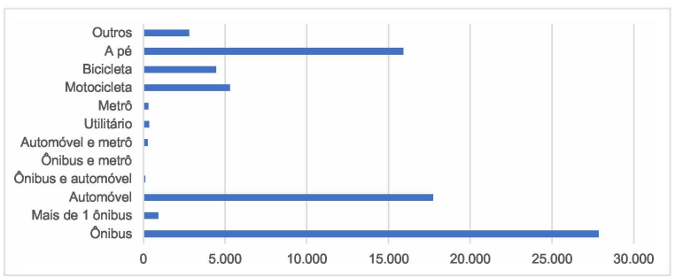

 Fonte: SILVA, Felipe Cláudio Ribeiro da. Luziânia, Plano Diretor e inserção metropolitana. 2019. Dissertação (Mestrado em Arquitetura e Urbanismo) - Faculdade de Arquitetura e Urbanismo, Programa de Pós-Graduação, Universidade de Brasília (UnB), Brasília, DF

De acordo com a análise estudal do RIDE-DF (Região Integrada de Desenvolvimento do Distrito Federal), a maioria das pessoas vindas de Luziânia que trabalham ou estudam no Distrito Federal tem entre 15 e 49 anos, sendo majoritariamente homens.

 Figura 2 - Número de pessoas que moram em Luziânia e trabalham ou estudam no DF 

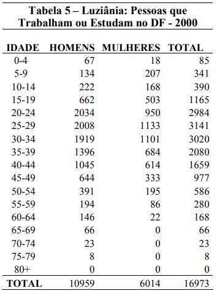

 Fonte: CAMPOS, Neio Lucio de Oliveira (Coord.). Relatório Estadual "Distrito Federal + RIDE". Brasília, DF: Universidade de Brasília, 2010.

Mesmo com certa diferença entre os períodos de cada estudo, é possível inferir um padrão das pessoas que utilizam o transporte público de Luziânia para o Distrito Federal.

## Resultado do questionário
Com as respostas do formulário foi possível reafirmar as informações anteriormente obtidas, o formulário teve maior repercusão entre estudades do campus Gama da Universidade de Brasília, em que a maioria dos usuários são estudantes com a faixa etária entre 18 e 24 anos, em grande parte homens com grau de escolaridade superior incompleto com uma boa experiência em tecnologia que utilizam de maneira frequente aplicativos para consulta de linhas e horários de ônibus e com experiência em compras online.  

O formulário também contou com um Termo de Consentimento Livre e Esclarecido conforme descrito na secção de [aspectos éticos](etica.md/) e deve adesão de todos os participantes do formulário como pode ser visto na Figura 3.  

 Figura 3 -    Termo de Consentimento 

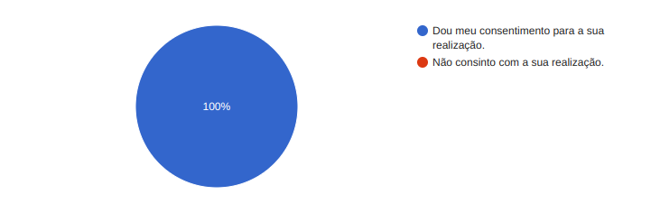

 Fonte:  [Yasmim Rosa](https://github.com/yaskisoba) e [Marco Tulio](https://github.com/MarcoTulioSoares) 

A seguir está o resultado de cada pergunta e suas respectivas respostas.

### Idade
Majoritariamente, de acordo com a Figura 4, a idade está entre 14 e 24 anos.

 Figura 4 - Idade 

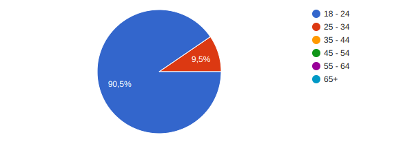

 Fonte:  [Yasmim Rosa](https://github.com/yaskisoba) e [Marco Tulio](https://github.com/MarcoTulioSoares) 

### Gênero
Majoritariamente, de acordo com a Figura 5, o gênero é masculino.

 Figura 5 - Gênero 

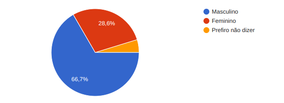

 Fonte:  [Yasmim Rosa](https://github.com/yaskisoba) e [Marco Tulio](https://github.com/MarcoTulioSoares) 

### Grau de escolaridade
De acordo com a Figura 6, o grau de escolaridade é ensino superior incompleto.

 Figura 6 - Grau de escolaridade 

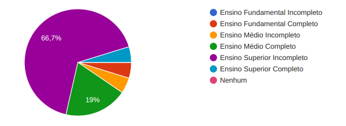

 Fonte:  [Yasmim Rosa](https://github.com/yaskisoba) e [Marco Tulio](https://github.com/MarcoTulioSoares) 

### Nível de experiência com tecnologia
Majoritariamente, de acordo com a Figura 7, o nível de conhecimento tecnológico é excelente.

 Figura 7 - Nível de conhecimento tecnológico 

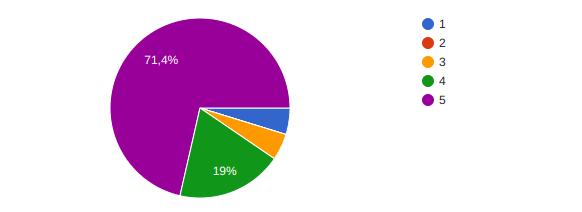

 Fonte:  [Yasmim Rosa](https://github.com/yaskisoba) e [Marco Tulio](https://github.com/MarcoTulioSoares) 

### Tolerância
Todos, de acordo com a Figura 8, tem uma sensibilidade pequena a frustrações decorrente da má usabilidade.

 Figura 8 - Senbilidade às frustrações 

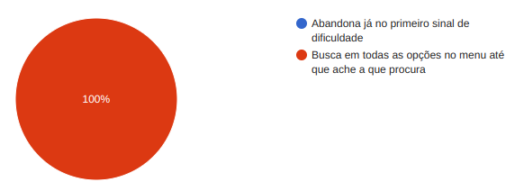

 Fonte:  [Yasmim Rosa](https://github.com/yaskisoba) e [Marco Tulio](https://github.com/MarcoTulioSoares) 

### Meios digitais para consulta e demais atividades
De acordo com a Figura 9, pelo menos às vezes eles utilizam meios digitais para obter informações de linhas de ônibus, etc.

 Figura 9 - Frequência de utilização de meios digitais 

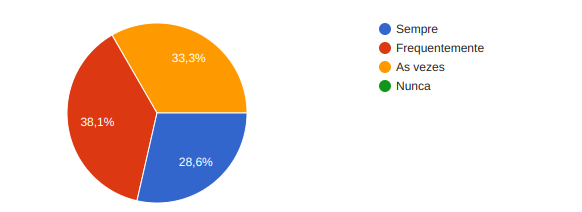

 Fonte:  [Yasmim Rosa](https://github.com/yaskisoba) e [Marco Tulio](https://github.com/MarcoTulioSoares) 

### Frequência de compras online de qualquer tipo
De acordo com a Figura 10, os participantes tem uma frequência considerável de compras online.

 Figura 10 - Frequência de compras online 

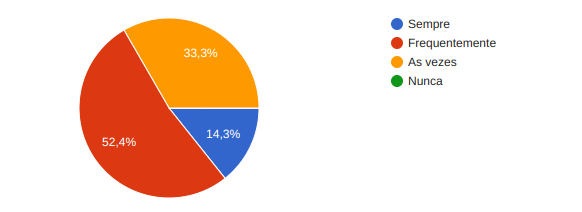

 Fonte:  [Yasmim Rosa](https://github.com/yaskisoba) e [Marco Tulio](https://github.com/MarcoTulioSoares) 

### Utilização de ônibus da central expresso (CT Expresso)
Majoritariamente, de acordo com a Figura 11, os participantes utilizam os ônibus da Central Expresso.

 Figura 11 - Utilização dos ônibus da Central Expresso 

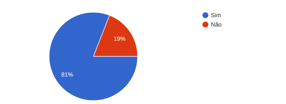

 Fonte:  [Yasmim Rosa](https://github.com/yaskisoba) e [Marco Tulio](https://github.com/MarcoTulioSoares) 

### Frequência de utilização de ônibus da Central Expresso (CT Expresso)
De acordo com a Figura 12, dentre aqueles que utilizam os ônibus da Central Expresso a maioria utiliza frequentemente ou as vezes.

 Figura 12 - Frequência de utilização dos ônibus da Central Expresso 

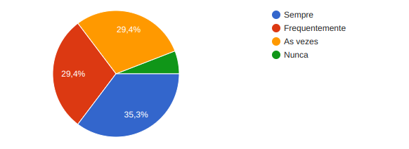

 Fonte:  [Yasmim Rosa](https://github.com/yaskisoba) e [Marco Tulio](https://github.com/MarcoTulioSoares) 

### Existência do site da empresa Central Expresso
De acordo com a Figura 13, dentre aqueles que utilizam os ônibus da Central Expresso, a maioria não tem conhecimento do site da empresa.

 Figura 13 - Site da Central Expresso 

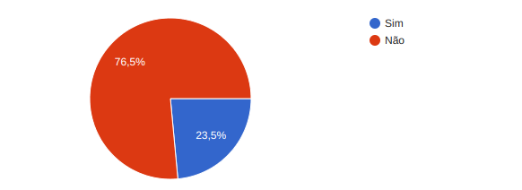

 Fonte:  [Yasmim Rosa](https://github.com/yaskisoba) e [Marco Tulio](https://github.com/MarcoTulioSoares) 

## Perfil do Usuário
Com base nas informações obtidas podemos então montar o perfil do usuário contido na **Tabela 1**.

 Tabela 1 - Perfil do Usuário 

| Característica | Descrição |
| --- | --- |
| Idade | Jovens de 18 a 34 anos |
| Gênero | Masculino |
| Grau de escolaridade | Ensino superior incompleto |
| Nível de conhecimento tecnológico | Experiente (tecnófilos) |
| Costume de realizar compras online | Frequente |
| Uso de aplicativos para checar linhas e horários de ônibus | Frequente |

 Fonte:  [Yasmim Rosa](https://github.com/yaskisoba) e [Marco Tulio](https://github.com/MarcoTulioSoares) 

A partir da descoberta do perfil do usuário serão elaboradas as personas e também escolhidos os participantes de futuras avaliações.

## Bibliografia
> BARBOSA, S. D. J.; SILVA, B. S. Interação Humano-Computador. Rio de Janeiro: Elsevier, 2011.  

> SILVA, Felipe Cláudio Ribeiro da. Luziânia, Plano Diretor e inserção metropolitana. 2019. Dissertação (Mestrado em Arquitetura e Urbanismo) - Faculdade de Arquitetura e Urbanismo, Programa de Pós-Graduação, Universidade de Brasília (UnB), Brasília, DF.  

> CAMPOS, Neio Lucio de Oliveira (Coord.). Relatório Estadual "Distrito Federal + RIDE". Brasília, DF: Universidade de Brasília, 2010.

## Histórico de Versões

| Versão |    Data    | Descrição                                 | Autor(es)                                       | Revisor(es)                                    |
| ------ | :--------: | ----------------------------------------- | ----------------------------------------------- | ---------------------------------------------- |
| 1.0    | 03/05/2024 | Perfil de Usuários |  [Yasmim Rosa](https://github.com/yaskisoba)   [Marco Tulio](https://github.com/MarcoTulioSoares)  | [Pedro Henrique](https://github.com/PedroHenrique061)  |
| 1.1    | 05/05/2024 | Ajuste de acordo com feedback |  [Yasmim Rosa](https://github.com/yaskisoba) | [Marco Tulio](https://github.com/MarcoTulioSoares)  |

